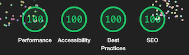

# Tic-Tac-Toe

This is a site to demonstrate how pure HTML, CCS and JavaScript can build a small game. The Tic-Tac-Toe game is a fully responsive JavaScript game that will allow two users to play aginst one another over and over again. 

## Features 

### Existing Features

- __The Tic-Tac-Toe Heading__

  - Featured at the top of the page. By the heading is easy for the user to se the name of the game.

- __The Game Board__

  - This section will allow the user to play the game. At start it is a clean board where users clicks on a square for each turn. It presumes the user knows how to play Tic-Tac-Toe. 
  

- __Game Over__

- When the game is over a modal window pops up that tells you who has won or if it's a draw. In the modal there is a restart button.

### Features Left to Implement

- One player against computor

## Testing 

Testing has been done under developmentprocess in the browser Google Chrome, . 

In this section, you need to convince the assessor that you have conducted enough testing to legitimately believe that the site works well. Essentially, in this part you will want to go over all of your project’s features and ensure that they all work as intended, with the project providing an easy and straightforward way for the users to achieve their goals.

In addition, you should mention in this section how your project looks and works on different browsers and screen sizes.

You should also mention in this section any interesting bugs or problems you discovered during your testing, even if you haven't addressed them yet.

### Validator Testing 

- HTML
    - No errors were returned when passing through the official [W3C validator](https://validator.w3.org/nu/?doc=https%3A%2F%2Fcode-institute-org.github.io%2Flove-maths%2F)
- CSS
    - No errors were found when passing through the official [(Jigsaw) validator](https://jigsaw.w3.org/css-validator/validator?uri=https%3A%2F%2Fsamskod.github.io%2Ftic-tac-toe%2F&profile=css3svg&usermedium=all&warning=1&vextwarning=&lang=en)
- JavaScript
    - No errors were found when passing through the official [Jshint validator](https://jshint.com/)
      - The following metrics were returned: 
      - There are 9 functions in this file.
      - Function with the largest signature take 2 arguments, while the median is 1.
      - Largest function has 11 statements in it, while the median is 6.
      - The most complex function has a cyclomatic complexity value of 5 while the median is 3.
    - 26 warnings because let is used to declare variables.
- Accessibility
    - The Lighthouse test tool show good result in accessibility

## Deployment

This section should describe the process you went through to deploy the project to a hosting platform (e.g. GitHub) 

The site was deployed to GitHub pages. The steps to deploy are as follows: In the GitHub repository, navigate to the Settings tab From the source section drop-down menu, select the Master Branch Once the master branch has been selected, the page will be automatically refreshed with a detailed ribbon display to indicate the successful deployment.
The live link can be found here - https://samskod.github.io/tic-tac-toe/

## Credits 

Example code and design is used from:

- Code Institute javascripts lessons
- CodeBrianers tutorial https://www.codebrainer.com/blog/tic-tac-toe-javascript-game
- W3School.com

### Content 

- Images for the X and O is taken from Clipart Library http://clipart-library.com/
- I have also gott a big help from W3Schools website https://www.w3schools.com/
